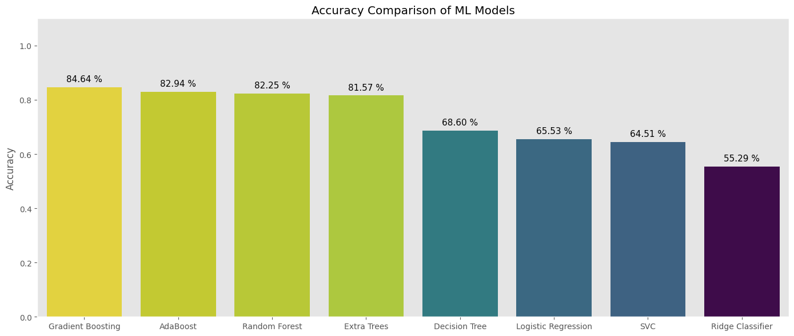
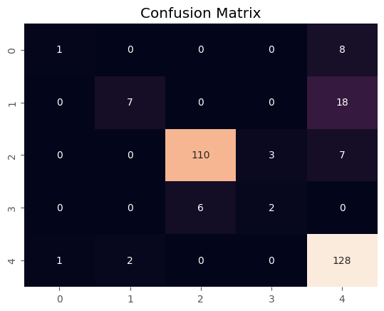

# Weather Forecasting Project
<div align="center">

[](https://python.org)
[](https://python.org)
[](https://numpy.org)
[](https://scikit-learn.org)
[](https://matplotlib.org)
[](https://seaborn.pydata.org)


</div>

## 📌 Overview
This project focuses on predicting weather conditions based on meteorological data. Using a dataset of daily weather observations, the project applies various Machine Learning algorithms to classify the weather into categories such as **Rain, Sun, Drizzle, Snow, and Fog**.

## 📂 Project Structure
- **`Model.ipynb`**: The Jupyter Notebook containing the end-to-end workflow: data preparation, visualization, preprocessing, and model training.
- **`seattle-weather.csv`**: The dataset containing historical weather data used for training and testing.

## 📊 Dataset Description
The [**Dataset**](https://www.kaggle.com/datasets/mahdiehhajian/seattle-weather/data) consists of daily records with the following features:

| Column | Description |
| :--- | :--- |
| **date** | The date of the observation |
| **precipitation** | Amount of precipitation |
| **temp_max** | Maximum temperature recorded |
| **temp_min** | Minimum temperature recorded |
| **wind** | Wind speed |
| **weather** | Target Variable (drizzle, rain, sun, snow, fog) |

## 🛠️ Technologies & Libraries
The project is built using Python and the following libraries:
* **Data Manipulation**: `pandas`, `numpy`
* **Visualization**: `seaborn`, `matplotlib`
* **Machine Learning** (Scikit-Learn):
    * `RandomForestClassifier`
    * `GradientBoostingClassifier`
    * `AdaBoostClassifier`
    * `LogisticRegression`
    * `SVC`
    * `DecisionTreeClassifier`
* **Preprocessing**: `imblearn` (RandomOverSampler), `StandardScaler`

## ⚙️ Data Preprocessing
To improve model performance, the following preprocessing steps were applied:

1.  **Feature Engineering**:
    * Extracted the **Month** from the `date` column to capture seasonal trends.
    * Dropped the original `date` column after extraction.

2.  **Handling Imbalanced Data**:
    * Analyzed the target distribution and identified class imbalance (e.g., significantly more "Sun" or "Rain" days than "Snow").
    * Applied **`RandomOverSampler`** to balance the dataset, ensuring the model learns equally from all weather types.

3.  **Data Splitting**:
    * Split the data into training and testing sets to evaluate performance on unseen data.

## 📈 Modeling & Evaluation
The notebook explores multiple classification algorithms. The primary workflow includes:
1.  **Training**: Fitting models (like Random Forest) on the oversampled training data.
2.  **Evaluation**: Using metrics such as **Accuracy Score**, **Confusion Matrix**, and **Classification Report** to assess performance.
3.  **Prediction**: Testing the model with custom inputs (e.g., specific month, temp, and wind conditions) to predict the weather.

## ✅ Models Accuracy


## 🟢 Confusion Matrix



## 🚀 How to Run
1.  Install the required dependencies:
    ```bash
    pip install pandas numpy seaborn matplotlib scikit-learn imbalanced-learn
    ```
2.  Ensure `seattle-weather.csv` is in the project directory.
3.  Open and run `Model.ipynb` to see the analysis and predictions.